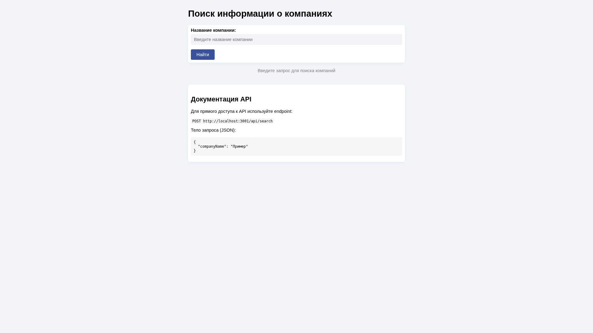
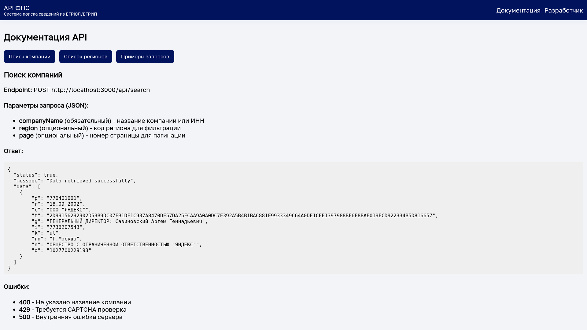
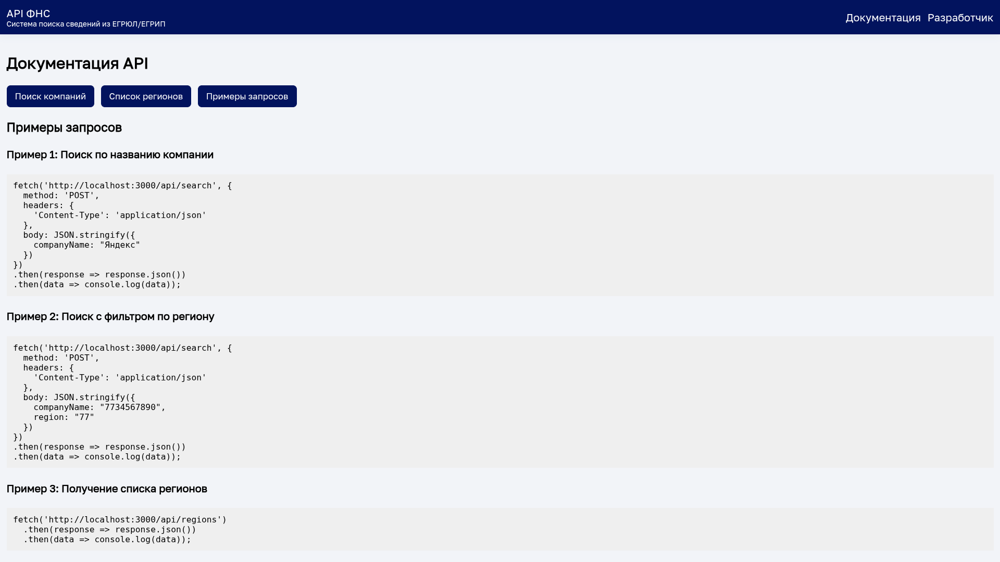
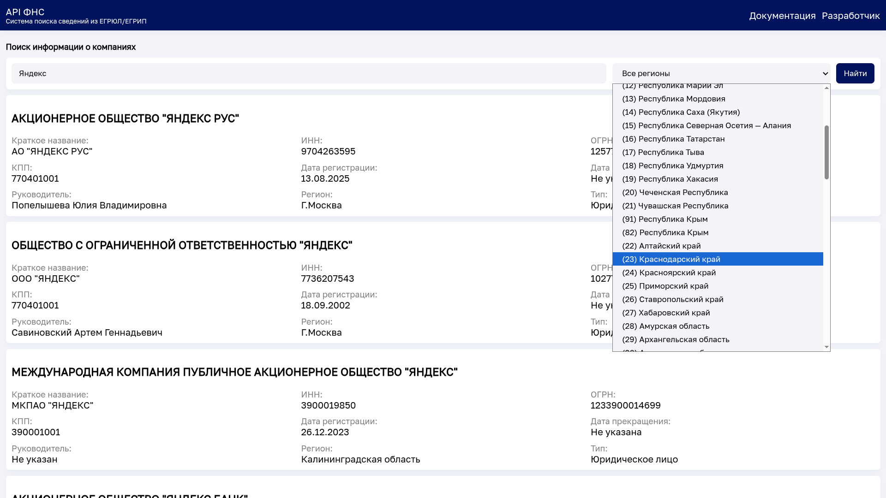
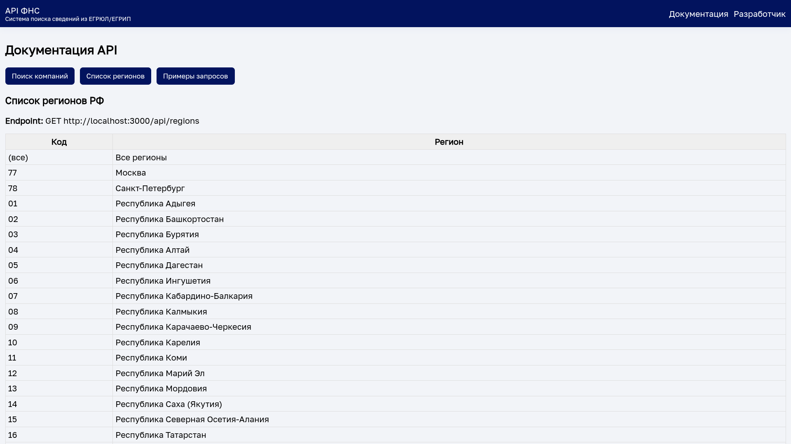

<<<<<<< HEAD
# Сервис для получения информации из ФНС
=======
# [в разработке] API для поиска организаций прямиком из ФНС
>>>>>>> origin/main

Этот проект предоставляет веб-интерфейс и API для получения актуальной информации о компаниях из официального источника ФНС России (nalog.gov.ru).

## Структура проекта

Проект состоит из двух основных компонентов:

- Клиентская часть: React-приложение
- Серверная часть: Node.js API сервер

Предварительные требования

- Node.js (версия 14 или выше)
- npm или yarn
- Git

Установка и запуск

1. Клонирование репозитория

```bash
git clone https://github.com/kaurcev/api-nalog-ru.git
cd api-nalog-ru
```

2. Настройка серверной части (Node.js)

```bash

cd server

npm install

npm run start
```

Сервер будет доступен по адресу: http://localhost:3000

3. Настройка клиентской части (React)

```bash
cd client

npm install

npm start
```

Клиентское приложение будет доступно по адресу: http://localhost:3001

4. Сборка для production

```bash
npm run build
```

Эта команда создаст оптимизированную сборку в папке build, которую можно разместить на любом HTTP-сервере.

## Конфигурация


Настройка клиента

В файле frontend/package.json можно изменить proxy на URL API:

```json
{
    "proxy": "http://localhost:3001",
}
```

## API endpoints

Поиск компаний

Endpoint: POST ```/api/search```

Параметры запроса (JSON):

- companyName (обязательный) - название компании или ИНН
- region (опциональный) - код региона для фильтрации

Пример запроса:

```javascript
fetch('http://localhost:3000/api/search', {
  method: 'POST',
  headers: {
    'Content-Type': 'application/json'
  },
  body: JSON.stringify({
    companyName: "Яндекс"
  })
})
.then(response => response.json())
.then(data => console.log(data));
```

Получение списка регионов

Endpoint: GET ```/api/regions```

Пример запроса:

```javascript
fetch('http://localhost:3000/api/regions')
  .then(response => response.json())
  .then(data => console.log(data));
```

Важные примечания

1. Сервис использует официальное API ФНС России, которое может изменяться
2. Возможны ограничения на частоту запросов
3. Для некоторых запросов может потребоваться ввод CAPTCHA
4. Проект предоставлен в ознакомительных целях

Получение помощи

Если у вас возникли проблемы с развертыванием:

1. Проверьте, что все зависимости установлены
2. Убедитесь, что порты 3000 и 3001 не заняты другими приложениями
3. Проверьте настройки CORS, если клиент и сервер на разных доменах

### Лицензия

Этот проект предоставляется "как есть", без каких-либо гарантий. Использование API ФНС регулируется соответствующими правовыми актами Российской Федерации.

### Скриншоты

|                                                 |                                                 |
| ----------------------------------------------- | ----------------------------------------------- |
|  |  |
|  |  |
|  |  |


<<<<<<< HEAD
> Предоставлено исключительно в ознакомительных целях. Использовать на свой страх и риск.
=======
> Скоро доработаю. Предоставлено исключительно в ознакомительных целях. Использовать на свой страх и риск.
>>>>>>> origin/main
